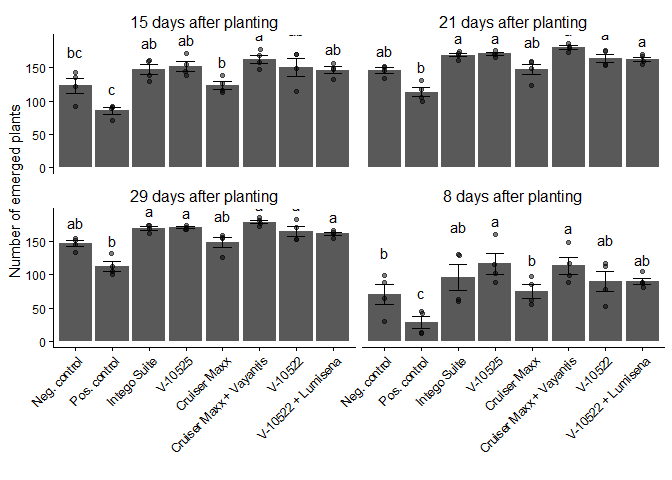
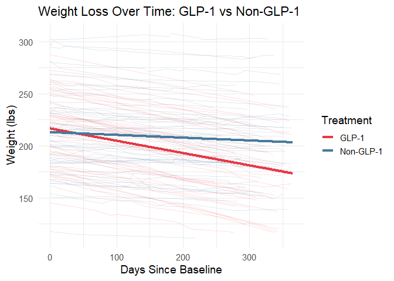
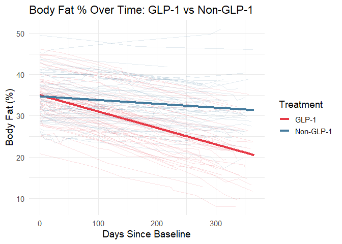

# About

This is a script to plot sampling locations on the map for this study

- **input:** NCST_SeedTreatmentTrials_FinalData_2025-02-28.rds
- **output:** Figures 1 and Table 1

It was originally developed by Zachary Noel, Auburn University

# Global Setup

``` r
# Libraries needed
library(tidyverse)
# install.packages("usmap")
library(usmap)
# install.packages("maps")
library(maps)
# install.packages("mapdata")
library(mapdata)
# install.package("lme4)
library(lme4)
# set the default global option for displaying code chunks
knitr::opts_chunk$set(echo = TRUE)
# this sets the root file project to the main R project directory not location of current Rmd file
knitr::opts_knit$set(root.dir = rprojroot::find_rstudio_root_file())
setwd(rprojroot::find_rstudio_root_file())
```

# RENV - Environment Control

The renv package helps you create reproducible environments for your R
projects. This vignette introduces you to the basic nouns and verbs of
renv, like the user and project libraries, and key functions like
renv::init(), renv::snapshot() and renv::restore(). You’ll also learn
about some of the infrastructure that makes renv tick, some problems
that renv doesn’t help with, and how to uninstall it if you no longer
want to use it.

RENV allows you store packages in the environment in a ‘lockfile’, which
enables you users to restore packages using the ‘lockfile’.

<figure>

<figcaption aria-hidden="true">RENV Figure Schematic</figcaption>
</figure>

## Install RENV

``` r
# install.packages("renv")
library(renv)
```

    ## Warning: package 'renv' was built under R version 4.5.3

    ## 
    ## Attaching package: 'renv'

    ## The following object is masked from 'package:Matrix':
    ## 
    ##     update

    ## The following object is masked from 'package:purrr':
    ## 
    ##     modify

    ## The following objects are masked from 'package:stats':
    ## 
    ##     embed, update

    ## The following objects are masked from 'package:utils':
    ## 
    ##     history, upgrade

    ## The following objects are masked from 'package:base':
    ## 
    ##     autoload, load, remove, use

## RENV Initialize

``` r
# this will initialize the environment
renv::init()
```

## Updating packages

``` r
# this will update and should be used after publications
renv::update()
# this will upgrade RENV but not underlying packages
renv::upgrade()
# snapshot updates the lockfile
renv::snapshot() 
```

## Uninstall RENV

To deactivate renv in a project, use:

``` r
renv::deactivate()
# This removes the renv auto-loader from the project .Rprofile, but doesn’t touch any other renv files used in the project.
#If you’d like to later re-activate renv, you can do so with
renv::activate()
```

## Using RENV - Collaboration

``` r
renv::restore() 
#this installs the specific package versions recorded in the lockfile.
```

# Notes on Difficult Portions

## Subsetting

``` r
mtcars
```

    ##                      mpg cyl  disp  hp drat    wt  qsec vs am gear carb
    ## Mazda RX4           21.0   6 160.0 110 3.90 2.620 16.46  0  1    4    4
    ## Mazda RX4 Wag       21.0   6 160.0 110 3.90 2.875 17.02  0  1    4    4
    ## Datsun 710          22.8   4 108.0  93 3.85 2.320 18.61  1  1    4    1
    ## Hornet 4 Drive      21.4   6 258.0 110 3.08 3.215 19.44  1  0    3    1
    ## Hornet Sportabout   18.7   8 360.0 175 3.15 3.440 17.02  0  0    3    2
    ## Valiant             18.1   6 225.0 105 2.76 3.460 20.22  1  0    3    1
    ## Duster 360          14.3   8 360.0 245 3.21 3.570 15.84  0  0    3    4
    ## Merc 240D           24.4   4 146.7  62 3.69 3.190 20.00  1  0    4    2
    ## Merc 230            22.8   4 140.8  95 3.92 3.150 22.90  1  0    4    2
    ## Merc 280            19.2   6 167.6 123 3.92 3.440 18.30  1  0    4    4
    ## Merc 280C           17.8   6 167.6 123 3.92 3.440 18.90  1  0    4    4
    ## Merc 450SE          16.4   8 275.8 180 3.07 4.070 17.40  0  0    3    3
    ## Merc 450SL          17.3   8 275.8 180 3.07 3.730 17.60  0  0    3    3
    ## Merc 450SLC         15.2   8 275.8 180 3.07 3.780 18.00  0  0    3    3
    ## Cadillac Fleetwood  10.4   8 472.0 205 2.93 5.250 17.98  0  0    3    4
    ## Lincoln Continental 10.4   8 460.0 215 3.00 5.424 17.82  0  0    3    4
    ## Chrysler Imperial   14.7   8 440.0 230 3.23 5.345 17.42  0  0    3    4
    ## Fiat 128            32.4   4  78.7  66 4.08 2.200 19.47  1  1    4    1
    ## Honda Civic         30.4   4  75.7  52 4.93 1.615 18.52  1  1    4    2
    ## Toyota Corolla      33.9   4  71.1  65 4.22 1.835 19.90  1  1    4    1
    ## Toyota Corona       21.5   4 120.1  97 3.70 2.465 20.01  1  0    3    1
    ## Dodge Challenger    15.5   8 318.0 150 2.76 3.520 16.87  0  0    3    2
    ## AMC Javelin         15.2   8 304.0 150 3.15 3.435 17.30  0  0    3    2
    ## Camaro Z28          13.3   8 350.0 245 3.73 3.840 15.41  0  0    3    4
    ## Pontiac Firebird    19.2   8 400.0 175 3.08 3.845 17.05  0  0    3    2
    ## Fiat X1-9           27.3   4  79.0  66 4.08 1.935 18.90  1  1    4    1
    ## Porsche 914-2       26.0   4 120.3  91 4.43 2.140 16.70  0  1    5    2
    ## Lotus Europa        30.4   4  95.1 113 3.77 1.513 16.90  1  1    5    2
    ## Ford Pantera L      15.8   8 351.0 264 4.22 3.170 14.50  0  1    5    4
    ## Ferrari Dino        19.7   6 145.0 175 3.62 2.770 15.50  0  1    5    6
    ## Maserati Bora       15.0   8 301.0 335 3.54 3.570 14.60  0  1    5    8
    ## Volvo 142E          21.4   4 121.0 109 4.11 2.780 18.60  1  1    4    2

``` r
#subsetting
mtcars[1,] # 1st row
```

    ##           mpg cyl disp  hp drat   wt  qsec vs am gear carb
    ## Mazda RX4  21   6  160 110  3.9 2.62 16.46  0  1    4    4

``` r
mtcars[1,3] # row 1, column 3
```

    ## [1] 160

``` r
# find all rows such that VS = 1 : 2 ways
mtcars[mtcars$vs == 1,]
```

    ##                 mpg cyl  disp  hp drat    wt  qsec vs am gear carb
    ## Datsun 710     22.8   4 108.0  93 3.85 2.320 18.61  1  1    4    1
    ## Hornet 4 Drive 21.4   6 258.0 110 3.08 3.215 19.44  1  0    3    1
    ## Valiant        18.1   6 225.0 105 2.76 3.460 20.22  1  0    3    1
    ## Merc 240D      24.4   4 146.7  62 3.69 3.190 20.00  1  0    4    2
    ## Merc 230       22.8   4 140.8  95 3.92 3.150 22.90  1  0    4    2
    ## Merc 280       19.2   6 167.6 123 3.92 3.440 18.30  1  0    4    4
    ## Merc 280C      17.8   6 167.6 123 3.92 3.440 18.90  1  0    4    4
    ## Fiat 128       32.4   4  78.7  66 4.08 2.200 19.47  1  1    4    1
    ## Honda Civic    30.4   4  75.7  52 4.93 1.615 18.52  1  1    4    2
    ## Toyota Corolla 33.9   4  71.1  65 4.22 1.835 19.90  1  1    4    1
    ## Toyota Corona  21.5   4 120.1  97 3.70 2.465 20.01  1  0    3    1
    ## Fiat X1-9      27.3   4  79.0  66 4.08 1.935 18.90  1  1    4    1
    ## Lotus Europa   30.4   4  95.1 113 3.77 1.513 16.90  1  1    5    2
    ## Volvo 142E     21.4   4 121.0 109 4.11 2.780 18.60  1  1    4    2

``` r
subset(mtcars, vs == 1)
```

    ##                 mpg cyl  disp  hp drat    wt  qsec vs am gear carb
    ## Datsun 710     22.8   4 108.0  93 3.85 2.320 18.61  1  1    4    1
    ## Hornet 4 Drive 21.4   6 258.0 110 3.08 3.215 19.44  1  0    3    1
    ## Valiant        18.1   6 225.0 105 2.76 3.460 20.22  1  0    3    1
    ## Merc 240D      24.4   4 146.7  62 3.69 3.190 20.00  1  0    4    2
    ## Merc 230       22.8   4 140.8  95 3.92 3.150 22.90  1  0    4    2
    ## Merc 280       19.2   6 167.6 123 3.92 3.440 18.30  1  0    4    4
    ## Merc 280C      17.8   6 167.6 123 3.92 3.440 18.90  1  0    4    4
    ## Fiat 128       32.4   4  78.7  66 4.08 2.200 19.47  1  1    4    1
    ## Honda Civic    30.4   4  75.7  52 4.93 1.615 18.52  1  1    4    2
    ## Toyota Corolla 33.9   4  71.1  65 4.22 1.835 19.90  1  1    4    1
    ## Toyota Corona  21.5   4 120.1  97 3.70 2.465 20.01  1  0    3    1
    ## Fiat X1-9      27.3   4  79.0  66 4.08 1.935 18.90  1  1    4    1
    ## Lotus Europa   30.4   4  95.1 113 3.77 1.513 16.90  1  1    5    2
    ## Volvo 142E     21.4   4 121.0 109 4.11 2.780 18.60  1  1    4    2

``` r
# just the hp
mtcars$hp[mtcars$vs == 1]
```

    ##  [1]  93 110 105  62  95 123 123  66  52  65  97  66 113 109

``` r
# multiple
mtcars[mtcars$vs == 1 & mtcars$gear == 4,]
```

    ##                 mpg cyl  disp  hp drat    wt  qsec vs am gear carb
    ## Datsun 710     22.8   4 108.0  93 3.85 2.320 18.61  1  1    4    1
    ## Merc 240D      24.4   4 146.7  62 3.69 3.190 20.00  1  0    4    2
    ## Merc 230       22.8   4 140.8  95 3.92 3.150 22.90  1  0    4    2
    ## Merc 280       19.2   6 167.6 123 3.92 3.440 18.30  1  0    4    4
    ## Merc 280C      17.8   6 167.6 123 3.92 3.440 18.90  1  0    4    4
    ## Fiat 128       32.4   4  78.7  66 4.08 2.200 19.47  1  1    4    1
    ## Honda Civic    30.4   4  75.7  52 4.93 1.615 18.52  1  1    4    2
    ## Toyota Corolla 33.9   4  71.1  65 4.22 1.835 19.90  1  1    4    1
    ## Fiat X1-9      27.3   4  79.0  66 4.08 1.935 18.90  1  1    4    1
    ## Volvo 142E     21.4   4 121.0 109 4.11 2.780 18.60  1  1    4    2

``` r
# car with most hp
max(mtcars$hp)
```

    ## [1] 335

``` r
#max or min value
mtcars[mtcars$hp == max(mtcars$hp),]
```

    ##               mpg cyl disp  hp drat   wt qsec vs am gear carb
    ## Maserati Bora  15   8  301 335 3.54 3.57 14.6  0  1    5    8

``` r
mtcars[mtcars$hp == min(mtcars$hp),]
```

    ##              mpg cyl disp hp drat    wt  qsec vs am gear carb
    ## Honda Civic 30.4   4 75.7 52 4.93 1.615 18.52  1  1    4    2

# Optional Learning Bonus Material

## Provided Bonus Material

I don’t work with map data but I do work with a lot of population health
data. In the future It would be interesting to plot things like BMI,
body fat % at a county level, which I haven’t seen in a publication.

``` r
### Color palletts etc. ###
cbbPalette <- c("black", "#999999", "#E69F00", "#56B4E9", "#009E73", "#F0E442", "#0072B2", "#D55E00")
options(dplyr.print_max = 1e9)

#### Read in the data needed, which is the output of the preprocessing script

seedtreatment.prediction.nona <- readRDS("NCST_SeedTreatmentTrials_FinalData_2025-02-28.rds")

##### Map of sampling: Figure 1. ####
# Load in acrage planted map
counties <- map_data("county")
counties$State <- toupper(counties$region)
counties$County <- toupper(counties$subregion)

cotton.acres.harvested.county <- read.csv("1C1BDA3A-B866-36C2-B2AD-0FD203944B03.csv") # data downloaded from NASS
str(cotton.acres.harvested.county)
cotton.acres.harvested.bycounty <- cotton.acres.harvested.county %>%
  group_by(State, County) %>%
  summarise(mean.acres.harvested = mean(Value))

state.data <- map_data("state")
state.data$State <- toupper(state.data$region)

state.data2 <- state.data %>%
  subset(State %in% c("ALABAMA",
                      "FLORIDA",
                      "TEXAS", 
                      "ARKANSAS",
                      "MISSISSIPPI",
                      "SOUTH CAROLINA",
                      "NORTH CAROLINA",
                      "VIRGINIA",
                      "LOUISIANA",
                      "TENNESSEE",
                      "GEORGIA",
                      "OKLAHOMA"))

cotton.acres.harvested.bycounty2 <- left_join(counties, cotton.acres.harvested.bycounty, by = c("State", "County"))
cotton.acres.harvested.bycounty.plot <- cotton.acres.harvested.bycounty2 %>%
  subset(State %in% c("ALABAMA",
                      "FLORIDA",
                      "TEXAS", 
                      "ARKANSAS",
                      "MISSISSIPPI",
                      "SOUTH CAROLINA",
                      "NORTH CAROLINA",
                      "VIRGINIA",
                      "LOUISIANA",
                      "TENNESSEE",
                      "GEORGIA",
                      "OKLAHOMA")) 

# convert to hectares
cotton.acres.harvested.bycounty.plot$Hectares <- cotton.acres.harvested.bycounty.plot$mean.acres.harvested*0.404686
map.points <- seedtreatment.prediction.nona %>%
  group_by(Long, Lat) %>%
  tally()

##### Figure 1 ####
Fig1 <- ggplot() + 
  geom_polygon(data = cotton.acres.harvested.bycounty.plot, mapping=aes(x=long, y=lat, group=group, fill = Hectares), color = "grey", size = 0.05) + 
  geom_polygon(data = state.data2, mapping = aes(x = long, y = lat, group = group), color = "black", fill = NA) +
  scale_fill_gradient(high = "#4F7942", low = "#ECFFDC", na.value = "white", name = "Ave. Hectares \n Upland Cotton \n Harvested 1993-2023") +
  geom_point(data = map.points, aes(x = Long, y = Lat, size = n), fill = cbbPalette[[8]], color = "black", alpha = 0.6, shape = 21) +
  scale_size(name = "Years in \n National Cotton \n Seedtreatment Trials") +
  theme_minimal() +
  theme(legend.position="right") +
  coord_map("albers",  lat0 = 45.5, lat1 = 29.5) +
  xlab("Longitude") +
  ylab("Latitude")
Fig1

#### Summary statistics for percentage of land on average with these states. Justification for the samples. ####
cotton.acres.harvested.summary <- cotton.acres.harvested.county %>%
  group_by(State, Year) %>%
  summarise(sum.acres.harvested = sum(Value)) %>%
  group_by(State) %>%
  summarise(mean.acres.harvested = mean(sum.acres.harvested)) 

cotton.acres.harvested.summary$percent <- 100 *(cotton.acres.harvested.summary$mean.acres.harvested/sum(cotton.acres.harvested.summary$mean.acres.harvested))

cotton.acres.harvested.summary %>%
  subset(State %in% c("ALABAMA",
                      "FLORIDA",
                      "TEXAS", 
                      "ARKANSAS",
                      "MISSISSIPPI",
                      "VIRGINIA",
                      "LOUISIANA",
                      "TENNESSEE",
                      "GEORGIA",
                      "OKLAHOMA")) %>%
  summarise(sum.sampled = sum(percent)) 


#### General Summary Statistics: Table 1 ####

# Earliest and latest planting date to select weather data interval
date.moth.day <- format(seedtreatment.prediction.nona$Planted, format="%m-%d")
sort(date.moth.day)

# 10 site-years were planted in February or June. 
# 97.5% of the site-years planted in March to May
(dim(seedtreatment.prediction.nona)[[1]] - 10)/dim(seedtreatment.prediction.nona)[[1]] 

# Number of trials per state
trials.per.state <- seedtreatment.prediction.nona %>%
  group_by(State) %>%
  summarise(min.trial.date = min(Year2),
            max.trial.date = max(Year2),
            n.trials = n())

# Unique locations per state
unique.per.state <- seedtreatment.prediction.nona %>%
  group_by(State, Field_Location_Code, Lat, Long) %>%
  summarise(n.trials = n(),
            min.trial.date = min(Year2),
            max.trial.date = max(Year2)) %>%
  mutate(n_years = max.trial.date - min.trial.date) %>%
  group_by(State) %>%
  tally()

table.1 <- left_join(trials.per.state, unique.per.state)

sum(table.1$n.trials) # 405 trials
sum(table.1$n) # 38 unique locations

# Locations table
loc.table <- seedtreatment.prediction.nona %>%
  group_by(State, Field_Location_Code, Lat, Long) %>%
  summarise(n.trials = n(),
            min.trial.date = min(Year2),
            max.trial.date = max(Year2))
```

## Self Learning Bonus Material

### Adding significance letters to represent multiple pairwise comparisons of an ANOVA

This is from a previous weeks homework but we weren’t provided the data
set. I’ve gone back with the data set now available to complete.

For my dissertation I will be using linear mixed effects modeling so I
want to become better versed in this type of analysis.

``` r
library(lme4)
library(emmeans) #version 1.8.7
```

    ## Welcome to emmeans.
    ## Caution: You lose important information if you filter this package's results.
    ## See '? untidy'

``` r
library(multcomp)
```

    ## Warning: package 'multcomp' was built under R version 4.5.3

    ## Loading required package: mvtnorm

    ## Loading required package: survival

    ## Loading required package: TH.data

    ## Loading required package: MASS

    ## 
    ## Attaching package: 'MASS'

    ## The following object is masked from 'package:dplyr':
    ## 
    ##     select

    ## 
    ## Attaching package: 'TH.data'

    ## The following object is masked from 'package:MASS':
    ## 
    ##     geyser

``` r
library(multcompView)
```

    ## Warning: package 'multcompView' was built under R version 4.5.3

### Read in the data

``` r
STAND <- read.csv("data_files/raw_data_valent2023_pythium_seedtreatment.csv", na.strings = "na")
```

### Calculate the means by groups

``` r
ave_stand <- STAND %>%
  filter(days_post_planting != "173 days after planting") %>%
  group_by(Plot, Treatment_name, Rep, days_post_planting) %>%
  dplyr::summarize(
    ave.stand = mean(stand, na.rm=TRUE)) 
```

    ## `summarise()` has regrouped the output.
    ## ℹ Summaries were computed grouped by Plot, Treatment_name, Rep, and
    ##   days_post_planting.
    ## ℹ Output is grouped by Plot, Treatment_name, and Rep.
    ## ℹ Use `summarise(.groups = "drop_last")` to silence this message.
    ## ℹ Use `summarise(.by = c(Plot, Treatment_name, Rep, days_post_planting))` for
    ##   per-operation grouping (`?dplyr::dplyr_by`) instead.

``` r
#Linear model
lm <- lmer(ave.stand ~ Treatment_name*days_post_planting + (1|Rep), data = ave_stand)
car::Anova(lm)
```

    ## Registered S3 method overwritten by 'car':
    ##   method           from
    ##   na.action.merMod lme4

    ## Analysis of Deviance Table (Type II Wald chisquare tests)
    ## 
    ## Response: ave.stand
    ##                                      Chisq Df Pr(>Chisq)    
    ## Treatment_name                    206.6016  7     <2e-16 ***
    ## days_post_planting                364.7096  3     <2e-16 ***
    ## Treatment_name:days_post_planting   5.9066 21     0.9995    
    ## ---
    ## Signif. codes:  0 '***' 0.001 '**' 0.01 '*' 0.05 '.' 0.1 ' ' 1

``` r
lsmeans <- emmeans(lm, ~Treatment_name|days_post_planting) # estimate lsmeans of variety within siteXyear
Results_lsmeansEC <- multcomp::cld(lsmeans, alpha = 0.05, reversed = TRUE, details = TRUE,  Letters = letters) # contrast with Tukey ajustment
Results_lsmeansEC
```

    ## $emmeans
    ## days_post_planting = 15 days after planting:
    ##  Treatment_name          emmean   SE df lower.CL upper.CL .group
    ##  Cruiser Maxx + Vayantis  162.9 8.71 96    145.6    180.2  a    
    ##  V-10525                  152.2 8.71 96    135.0    169.5  ab   
    ##  V-10522                  150.5 8.71 96    133.2    167.8  ab   
    ##  Intego Suite             147.0 8.71 96    129.7    164.3  ab   
    ##  V-10522 + Lumisena       146.4 8.71 96    129.1    163.7  ab   
    ##  Cruiser Maxx             123.6 8.71 96    106.3    140.9   b   
    ##  Neg. control             122.9 8.71 96    105.6    140.2   bc  
    ##  Pos. control              85.2 8.71 96     68.0    102.5    c  
    ## 
    ## days_post_planting = 21 days after planting:
    ##  Treatment_name          emmean   SE df lower.CL upper.CL .group
    ##  Cruiser Maxx + Vayantis  180.5 8.71 96    163.2    197.8  a    
    ##  V-10525                  170.8 8.71 96    153.5    188.0  a    
    ##  Intego Suite             169.1 8.71 96    151.8    186.4  a    
    ##  V-10522                  164.5 8.71 96    147.2    181.8  a    
    ##  V-10522 + Lumisena       162.6 8.71 96    145.3    179.9  a    
    ##  Cruiser Maxx             147.5 8.71 96    130.2    164.8  ab   
    ##  Neg. control             145.9 8.71 96    128.6    163.2  ab   
    ##  Pos. control             113.1 8.71 96     95.8    130.4   b   
    ## 
    ## days_post_planting = 29 days after planting:
    ##  Treatment_name          emmean   SE df lower.CL upper.CL .group
    ##  Cruiser Maxx + Vayantis  179.5 8.71 96    162.2    196.8  a    
    ##  V-10525                  170.9 8.71 96    153.6    188.2  a    
    ##  Intego Suite             170.2 8.71 96    153.0    187.5  a    
    ##  V-10522                  165.0 8.71 96    147.7    182.3  a    
    ##  V-10522 + Lumisena       161.8 8.71 96    144.5    179.0  a    
    ##  Cruiser Maxx             148.9 8.71 96    131.6    166.2  ab   
    ##  Neg. control             146.8 8.71 96    129.5    164.0  ab   
    ##  Pos. control             112.5 8.71 96     95.2    129.8   b   
    ## 
    ## days_post_planting = 8 days after planting:
    ##  Treatment_name          emmean   SE df lower.CL upper.CL .group
    ##  V-10525                  116.6 8.71 96     99.3    133.9  a    
    ##  Cruiser Maxx + Vayantis  113.5 8.71 96     96.2    130.8  a    
    ##  Intego Suite              95.9 8.71 96     78.6    113.2  ab   
    ##  V-10522                   90.2 8.71 96     73.0    107.5  ab   
    ##  V-10522 + Lumisena        90.1 8.71 96     72.8    107.4  ab   
    ##  Cruiser Maxx              75.0 8.71 96     57.7     92.3   b   
    ##  Neg. control              70.5 8.71 96     53.2     87.8   b   
    ##  Pos. control              28.1 8.71 96     10.8     45.4    c  
    ## 
    ## Degrees-of-freedom method: kenward-roger 
    ## Confidence level used: 0.95 
    ## P value adjustment: tukey method for comparing a family of 8 estimates 
    ## significance level used: alpha = 0.05 
    ## NOTE: If two or more means share the same grouping symbol,
    ##       then we cannot show them to be different.
    ##       But we also did not show them to be the same. 
    ## 
    ## $comparisons
    ## days_post_planting = 15 days after planting:
    ##  contrast                                         estimate   SE df t.ratio
    ##  Neg. control - Pos. control                        37.625 12.3 93   3.058
    ##  Cruiser Maxx - Pos. control                        38.375 12.3 93   3.119
    ##  Cruiser Maxx - Neg. control                         0.750 12.3 93   0.061
    ##  (V-10522 + Lumisena) - Pos. control                61.125 12.3 93   4.969
    ##  (V-10522 + Lumisena) - Neg. control                23.500 12.3 93   1.910
    ##  (V-10522 + Lumisena) - Cruiser Maxx                22.750 12.3 93   1.849
    ##  Intego Suite - Pos. control                        61.750 12.3 93   5.019
    ##  Intego Suite - Neg. control                        24.125 12.3 93   1.961
    ##  Intego Suite - Cruiser Maxx                        23.375 12.3 93   1.900
    ##  Intego Suite - (V-10522 + Lumisena)                 0.625 12.3 93   0.051
    ##  (V-10522) - Pos. control                           65.250 12.3 93   5.304
    ##  (V-10522) - Neg. control                           27.625 12.3 93   2.245
    ##  (V-10522) - Cruiser Maxx                           26.875 12.3 93   2.185
    ##  (V-10522) - (V-10522 + Lumisena)                    4.125 12.3 93   0.335
    ##  (V-10522) - Intego Suite                            3.500 12.3 93   0.284
    ##  (V-10525) - Pos. control                           67.000 12.3 93   5.446
    ##  (V-10525) - Neg. control                           29.375 12.3 93   2.388
    ##  (V-10525) - Cruiser Maxx                           28.625 12.3 93   2.327
    ##  (V-10525) - (V-10522 + Lumisena)                    5.875 12.3 93   0.478
    ##  (V-10525) - Intego Suite                            5.250 12.3 93   0.427
    ##  (V-10525) - (V-10522)                               1.750 12.3 93   0.142
    ##  (Cruiser Maxx + Vayantis) - Pos. control           77.625 12.3 93   6.310
    ##  (Cruiser Maxx + Vayantis) - Neg. control           40.000 12.3 93   3.251
    ##  (Cruiser Maxx + Vayantis) - Cruiser Maxx           39.250 12.3 93   3.190
    ##  (Cruiser Maxx + Vayantis) - (V-10522 + Lumisena)   16.500 12.3 93   1.341
    ##  (Cruiser Maxx + Vayantis) - Intego Suite           15.875 12.3 93   1.290
    ##  (Cruiser Maxx + Vayantis) - (V-10522)              12.375 12.3 93   1.006
    ##  (Cruiser Maxx + Vayantis) - (V-10525)              10.625 12.3 93   0.864
    ##  p.value
    ##   0.0561
    ##   0.0476
    ##   1.0000
    ##  <0.0001
    ##   0.5476
    ##   0.5887
    ##  <0.0001
    ##   0.5135
    ##   0.5544
    ##   1.0000
    ##  <0.0001
    ##   0.3350
    ##   0.3706
    ##   1.0000
    ##   1.0000
    ##  <0.0001
    ##   0.2597
    ##   0.2906
    ##   0.9997
    ##   0.9999
    ##   1.0000
    ##  <0.0001
    ##   0.0330
    ##   0.0391
    ##   0.8805
    ##   0.9002
    ##   0.9725
    ##   0.9885
    ## 
    ## days_post_planting = 21 days after planting:
    ##  contrast                                         estimate   SE df t.ratio
    ##  Neg. control - Pos. control                        32.750 12.3 93   2.662
    ##  Cruiser Maxx - Pos. control                        34.375 12.3 93   2.794
    ##  Cruiser Maxx - Neg. control                         1.625 12.3 93   0.132
    ##  (V-10522 + Lumisena) - Pos. control                49.500 12.3 93   4.024
    ##  (V-10522 + Lumisena) - Neg. control                16.750 12.3 93   1.362
    ##  (V-10522 + Lumisena) - Cruiser Maxx                15.125 12.3 93   1.229
    ##  (V-10522) - Pos. control                           51.375 12.3 93   4.176
    ##  (V-10522) - Neg. control                           18.625 12.3 93   1.514
    ##  (V-10522) - Cruiser Maxx                           17.000 12.3 93   1.382
    ##  (V-10522) - (V-10522 + Lumisena)                    1.875 12.3 93   0.152
    ##  Intego Suite - Pos. control                        56.000 12.3 93   4.552
    ##  Intego Suite - Neg. control                        23.250 12.3 93   1.890
    ##  Intego Suite - Cruiser Maxx                        21.625 12.3 93   1.758
    ##  Intego Suite - (V-10522 + Lumisena)                 6.500 12.3 93   0.528
    ##  Intego Suite - (V-10522)                            4.625 12.3 93   0.376
    ##  (V-10525) - Pos. control                           57.625 12.3 93   4.684
    ##  (V-10525) - Neg. control                           24.875 12.3 93   2.022
    ##  (V-10525) - Cruiser Maxx                           23.250 12.3 93   1.890
    ##  (V-10525) - (V-10522 + Lumisena)                    8.125 12.3 93   0.660
    ##  (V-10525) - (V-10522)                               6.250 12.3 93   0.508
    ##  (V-10525) - Intego Suite                            1.625 12.3 93   0.132
    ##  (Cruiser Maxx + Vayantis) - Pos. control           67.375 12.3 93   5.477
    ##  (Cruiser Maxx + Vayantis) - Neg. control           34.625 12.3 93   2.814
    ##  (Cruiser Maxx + Vayantis) - Cruiser Maxx           33.000 12.3 93   2.682
    ##  (Cruiser Maxx + Vayantis) - (V-10522 + Lumisena)   17.875 12.3 93   1.453
    ##  (Cruiser Maxx + Vayantis) - (V-10522)              16.000 12.3 93   1.301
    ##  (Cruiser Maxx + Vayantis) - Intego Suite           11.375 12.3 93   0.925
    ##  (Cruiser Maxx + Vayantis) - (V-10525)               9.750 12.3 93   0.793
    ##  p.value
    ##   0.1477
    ##   0.1090
    ##   1.0000
    ##   0.0028
    ##   0.8720
    ##   0.9210
    ##   0.0017
    ##   0.7981
    ##   0.8632
    ##   1.0000
    ##   0.0004
    ##   0.5613
    ##   0.6497
    ##   0.9995
    ##   0.9999
    ##   0.0002
    ##   0.4731
    ##   0.5613
    ##   0.9978
    ##   0.9996
    ##   1.0000
    ##  <0.0001
    ##   0.1039
    ##   0.1412
    ##   0.8298
    ##   0.8965
    ##   0.9829
    ##   0.9931
    ## 
    ## days_post_planting = 29 days after planting:
    ##  contrast                                         estimate   SE df t.ratio
    ##  Neg. control - Pos. control                        34.250 12.3 93   2.784
    ##  Cruiser Maxx - Pos. control                        36.375 12.3 93   2.957
    ##  Cruiser Maxx - Neg. control                         2.125 12.3 93   0.173
    ##  (V-10522 + Lumisena) - Pos. control                49.250 12.3 93   4.003
    ##  (V-10522 + Lumisena) - Neg. control                15.000 12.3 93   1.219
    ##  (V-10522 + Lumisena) - Cruiser Maxx                12.875 12.3 93   1.047
    ##  (V-10522) - Pos. control                           52.500 12.3 93   4.267
    ##  (V-10522) - Neg. control                           18.250 12.3 93   1.483
    ##  (V-10522) - Cruiser Maxx                           16.125 12.3 93   1.311
    ##  (V-10522) - (V-10522 + Lumisena)                    3.250 12.3 93   0.264
    ##  Intego Suite - Pos. control                        57.750 12.3 93   4.694
    ##  Intego Suite - Neg. control                        23.500 12.3 93   1.910
    ##  Intego Suite - Cruiser Maxx                        21.375 12.3 93   1.737
    ##  Intego Suite - (V-10522 + Lumisena)                 8.500 12.3 93   0.691
    ##  Intego Suite - (V-10522)                            5.250 12.3 93   0.427
    ##  (V-10525) - Pos. control                           58.375 12.3 93   4.745
    ##  (V-10525) - Neg. control                           24.125 12.3 93   1.961
    ##  (V-10525) - Cruiser Maxx                           22.000 12.3 93   1.788
    ##  (V-10525) - (V-10522 + Lumisena)                    9.125 12.3 93   0.742
    ##  (V-10525) - (V-10522)                               5.875 12.3 93   0.478
    ##  (V-10525) - Intego Suite                            0.625 12.3 93   0.051
    ##  (Cruiser Maxx + Vayantis) - Pos. control           67.000 12.3 93   5.446
    ##  (Cruiser Maxx + Vayantis) - Neg. control           32.750 12.3 93   2.662
    ##  (Cruiser Maxx + Vayantis) - Cruiser Maxx           30.625 12.3 93   2.489
    ##  (Cruiser Maxx + Vayantis) - (V-10522 + Lumisena)   17.750 12.3 93   1.443
    ##  (Cruiser Maxx + Vayantis) - (V-10522)              14.500 12.3 93   1.179
    ##  (Cruiser Maxx + Vayantis) - Intego Suite            9.250 12.3 93   0.752
    ##  (Cruiser Maxx + Vayantis) - (V-10525)               8.625 12.3 93   0.701
    ##  p.value
    ##   0.1117
    ##   0.0730
    ##   1.0000
    ##   0.0030
    ##   0.9242
    ##   0.9658
    ##   0.0012
    ##   0.8143
    ##   0.8926
    ##   1.0000
    ##   0.0002
    ##   0.5476
    ##   0.6630
    ##   0.9971
    ##   0.9999
    ##   0.0002
    ##   0.5135
    ##   0.6295
    ##   0.9954
    ##   0.9997
    ##   1.0000
    ##  <0.0001
    ##   0.1477
    ##   0.2130
    ##   0.8348
    ##   0.9361
    ##   0.9950
    ##   0.9968
    ## 
    ## days_post_planting = 8 days after planting:
    ##  contrast                                         estimate   SE df t.ratio
    ##  Neg. control - Pos. control                        42.375 12.3 93   3.444
    ##  Cruiser Maxx - Pos. control                        46.875 12.3 93   3.810
    ##  Cruiser Maxx - Neg. control                         4.500 12.3 93   0.366
    ##  (V-10522 + Lumisena) - Pos. control                62.000 12.3 93   5.040
    ##  (V-10522 + Lumisena) - Neg. control                19.625 12.3 93   1.595
    ##  (V-10522 + Lumisena) - Cruiser Maxx                15.125 12.3 93   1.229
    ##  (V-10522) - Pos. control                           62.125 12.3 93   5.050
    ##  (V-10522) - Neg. control                           19.750 12.3 93   1.605
    ##  (V-10522) - Cruiser Maxx                           15.250 12.3 93   1.240
    ##  (V-10522) - (V-10522 + Lumisena)                    0.125 12.3 93   0.010
    ##  Intego Suite - Pos. control                        67.750 12.3 93   5.507
    ##  Intego Suite - Neg. control                        25.375 12.3 93   2.063
    ##  Intego Suite - Cruiser Maxx                        20.875 12.3 93   1.697
    ##  Intego Suite - (V-10522 + Lumisena)                 5.750 12.3 93   0.467
    ##  Intego Suite - (V-10522)                            5.625 12.3 93   0.457
    ##  (Cruiser Maxx + Vayantis) - Pos. control           85.375 12.3 93   6.940
    ##  (Cruiser Maxx + Vayantis) - Neg. control           43.000 12.3 93   3.495
    ##  (Cruiser Maxx + Vayantis) - Cruiser Maxx           38.500 12.3 93   3.129
    ##  (Cruiser Maxx + Vayantis) - (V-10522 + Lumisena)   23.375 12.3 93   1.900
    ##  (Cruiser Maxx + Vayantis) - (V-10522)              23.250 12.3 93   1.890
    ##  (Cruiser Maxx + Vayantis) - Intego Suite           17.625 12.3 93   1.433
    ##  (V-10525) - Pos. control                           88.500 12.3 93   7.194
    ##  (V-10525) - Neg. control                           46.125 12.3 93   3.749
    ##  (V-10525) - Cruiser Maxx                           41.625 12.3 93   3.383
    ##  (V-10525) - (V-10522 + Lumisena)                   26.500 12.3 93   2.154
    ##  (V-10525) - (V-10522)                              26.375 12.3 93   2.144
    ##  (V-10525) - Intego Suite                           20.750 12.3 93   1.687
    ##  (V-10525) - (Cruiser Maxx + Vayantis)               3.125 12.3 93   0.254
    ##  p.value
    ##   0.0187
    ##   0.0059
    ##   1.0000
    ##  <0.0001
    ##   0.7520
    ##   0.9210
    ##  <0.0001
    ##   0.7459
    ##   0.9178
    ##   1.0000
    ##  <0.0001
    ##   0.4466
    ##   0.6893
    ##   0.9998
    ##   0.9998
    ##  <0.0001
    ##   0.0160
    ##   0.0463
    ##   0.5544
    ##   0.5613
    ##   0.8397
    ##  <0.0001
    ##   0.0072
    ##   0.0224
    ##   0.3890
    ##   0.3953
    ##   0.6957
    ##   1.0000
    ## 
    ## Degrees-of-freedom method: kenward-roger 
    ## P value adjustment: tukey method for comparing a family of 8 estimates

### Extracting letters for the bars

``` r
# Extracting the letters for the bars
sig.diff.letters <- data.frame(Results_lsmeansEC$emmeans$Treatment_name, 
                               Results_lsmeansEC$emmeans$days_post_planting,
                               str_trim(Results_lsmeansEC$emmeans$.group))
colnames(sig.diff.letters) <- c("Treatment_name", 
                                "days_post_planting",
                                "Letters")

# for plotting with letters from significance test
ave_stand2 <- ave_stand %>%
  group_by(Treatment_name, days_post_planting) %>%
  dplyr::summarize(
    ave.stand2 = mean(ave.stand, na.rm=TRUE),
    se = sd(ave.stand)/sqrt(4)) %>%
  left_join(sig.diff.letters) 
```

    ## `summarise()` has regrouped the output.
    ## Joining with `by = join_by(Treatment_name, days_post_planting)`
    ## ℹ Summaries were computed grouped by Treatment_name and days_post_planting.
    ## ℹ Output is grouped by Treatment_name.
    ## ℹ Use `summarise(.groups = "drop_last")` to silence this message.
    ## ℹ Use `summarise(.by = c(Treatment_name, days_post_planting))` for
    ##   per-operation grouping (`?dplyr::dplyr_by`) instead.

``` r
ave_stand$Treatment_name <- factor(ave_stand$Treatment_name, levels = c("Neg. control",
                                                                        "Pos. control",
                                                                        "Intego Suite",
                                                                        "V-10525",
                                                                        "Cruiser Maxx",
                                                                        "Cruiser Maxx + Vayantis",
                                                                        "V-10522",
                                                                        "V-10522 + Lumisena"))

ave_stand$days_post_planting <- factor(ave_stand$days_post_planting, levels = c("8 days after planting",
                                                                                "15 days after planting", 
                                                                                "21 days after planting",
                                                                                "29 days after planting"))
```

### Final Plot

Here is the final plot with letters on the bars

``` r
### Stand bars ####
ggplot(ave_stand, aes(x = Treatment_name, y = ave.stand)) + 
  stat_summary(fun=mean,geom="bar") +
  stat_summary(fun.data = mean_se, geom = "errorbar", width = 0.5) +
  ylab("Number of emerged plants") + 
  geom_jitter(width = 0.02, alpha = 0.5) +
  geom_text(data = ave_stand2, aes(label = Letters, y = ave.stand2+(3*se)), vjust = -0.5) +
  xlab("")+
  theme_classic() +
  theme(
    strip.background = element_rect(color="white", fill="white", size=1.5, linetype="solid"),
    strip.text.x = element_text(size = 12, color = "black"),
    axis.text.x = element_text(angle = 45, vjust = 1, hjust=1)) +
  facet_wrap(~days_post_planting)
```

    ## Warning: The `size` argument of `element_rect()` is deprecated as of ggplot2 3.4.0.
    ## ℹ Please use the `linewidth` argument instead.
    ## This warning is displayed once per session.
    ## Call `lifecycle::last_lifecycle_warnings()` to see where this warning was
    ## generated.

<!-- -->

### Fake Weight Loss Data

I used Claude to generate a fake data set that mirrors what I anticipate
seeing in my actual data set. From there I used lme4, lmerTest, and
ggplot to generate a graph of weight and body fat% changes over time.

``` r
# ============================================================
# Linear Mixed Effects Modeling: GLP-1 vs Non-GLP-1 Weight Loss
# ============================================================

# -- Load libraries --
# lme4: fits the mixed effects models
# lmerTest: adds p-values to lme4 output (lme4 alone won't give you p-values)
# ggplot2: creates publication-quality graphs
library(lme4)
# install.packages("lmerTest")
library(lmerTest)  # you NEED this — without it, summary() won't show p-values
```

    ## 
    ## Attaching package: 'lmerTest'

    ## The following object is masked from 'package:lme4':
    ## 
    ##     lmer

    ## The following object is masked from 'package:stats':
    ## 
    ##     step

``` r
library(ggplot2)

# -- Read in the data --
df <- read.csv("data_files/weight_loss_data.csv")

# -- Inspect the structure --
# Always check your data before modeling
str(df)
```

    ## 'data.frame':    693 obs. of  6 variables:
    ##  $ participant_id     : chr  "P001" "P001" "P001" "P001" ...
    ##  $ treatment          : chr  "GLP-1" "GLP-1" "GLP-1" "GLP-1" ...
    ##  $ visit_date         : chr  "1/1/2025" "1/14/2025" "2/15/2025" "2/23/2025" ...
    ##  $ days_since_baseline: int  0 13 45 53 58 72 115 126 141 280 ...
    ##  $ weight_lbs         : num  214 210 208 206 207 ...
    ##  $ body_fat_pct       : num  35.8 34.5 35.5 34.1 32.9 34 32.2 32.3 30.8 26.5 ...

``` r
head(df)
```

    ##   participant_id treatment visit_date days_since_baseline weight_lbs
    ## 1           P001     GLP-1   1/1/2025                   0      213.7
    ## 2           P001     GLP-1  1/14/2025                  13      209.5
    ## 3           P001     GLP-1  2/15/2025                  45      207.8
    ## 4           P001     GLP-1  2/23/2025                  53      206.5
    ## 5           P001     GLP-1  2/28/2025                  58      206.9
    ## 6           P001     GLP-1  3/14/2025                  72      203.6
    ##   body_fat_pct
    ## 1         35.8
    ## 2         34.5
    ## 3         35.5
    ## 4         34.1
    ## 5         32.9
    ## 6         34.0

``` r
# -- Make sure treatment is a factor --
# R needs to know this is a categorical variable, not just text
df$treatment <- factor(df$treatment)

# -- Quick look at how many visits each person has --
# This shows the unbalanced design (some have 2 visits, some have 12)
# Mixed models handle this gracefully — that's a big reason we use them
table(table(df$participant_id))
```

    ## 
    ##  2  3  4  5  6  7  8  9 10 11 12 
    ##  8 10 12  6 12  9  8  8  9  8 10

``` r
# ============================================================
# MODEL 1: Weight over time by treatment group
# ============================================================

# Formula breakdown:
#   weight_lbs ~ days_since_baseline * treatment
#     - This is the FIXED effects part (the population-level trends)
#     - "days_since_baseline" = effect of time on weight
#     - "treatment" = difference between groups at baseline
#     - The "*" gives you the INTERACTION: does the rate of weight
#       change differ between GLP-1 and Non-GLP-1? (this is your key test)
#
#   (1 + days_since_baseline | participant_id)
#     - This is the RANDOM effects part (individual-level variation)
#     - "1" = each person gets their own intercept (starting weight varies)
#     - "days_since_baseline" = each person gets their own slope (rate of
#       change varies person to person)
#     - "| participant_id" = these random effects are grouped by person

weight_model <- lmer(
  weight_lbs ~ days_since_baseline * treatment + (1 + days_since_baseline | participant_id),
  data = df
)
```

    ## Warning in checkConv(attr(opt, "derivs"), opt$par, ctrl = control$checkConv, : Model failed to converge with max|grad| = 0.692494 (tol = 0.002, component 1)
    ##   See ?lme4::convergence and ?lme4::troubleshooting.

    ## Warning in checkConv(attr(opt, "derivs"), opt$par, ctrl = control$checkConv, : Model is nearly unidentifiable: very large eigenvalue
    ##  - Rescale variables?

``` r
# -- View results --
# The key line to look at is "days_since_baseline:treatmentNon-GLP-1"
# A significant p-value here means the two groups lose weight at different RATES
summary(weight_model)
```

    ## Linear mixed model fit by REML. t-tests use Satterthwaite's method [
    ## lmerModLmerTest]
    ## Formula: 
    ## weight_lbs ~ days_since_baseline * treatment + (1 + days_since_baseline |  
    ##     participant_id)
    ##    Data: df
    ## 
    ## REML criterion at convergence: 4722.9
    ## 
    ## Scaled residuals: 
    ##      Min       1Q   Median       3Q      Max 
    ## -1.48327 -0.28369 -0.01636  0.29179  1.57454 
    ## 
    ## Random effects:
    ##  Groups         Name                Variance  Std.Dev. Corr 
    ##  participant_id (Intercept)         2.486e+02 15.76856      
    ##                 days_since_baseline 3.741e-04  0.01934 0.15 
    ##  Residual                           2.626e+01  5.12401      
    ## Number of obs: 693, groups:  participant_id, 100
    ## 
    ## Fixed effects:
    ##                                          Estimate Std. Error         df t value
    ## (Intercept)                            216.491436   2.289019 588.738806   94.58
    ## days_since_baseline                     -0.117926   0.003866  99.631663  -30.51
    ## treatmentNon-GLP-1                      -3.588936   3.233063 587.768284   -1.11
    ## days_since_baseline:treatmentNon-GLP-1   0.091338   0.005460  97.957577   16.73
    ##                                        Pr(>|t|)    
    ## (Intercept)                              <2e-16 ***
    ## days_since_baseline                      <2e-16 ***
    ## treatmentNon-GLP-1                        0.267    
    ## days_since_baseline:treatmentNon-GLP-1   <2e-16 ***
    ## ---
    ## Signif. codes:  0 '***' 0.001 '**' 0.01 '*' 0.05 '.' 0.1 ' ' 1
    ## 
    ## Correlation of Fixed Effects:
    ##             (Intr) dys_s_ tN-GLP
    ## dys_snc_bsl -0.019              
    ## trtmN-GLP-1 -0.708  0.013       
    ## d__:N-GLP-1  0.013 -0.708 -0.016
    ## optimizer (nloptwrap) convergence code: 0 (OK)
    ## Model failed to converge with max|grad| = 0.692494 (tol = 0.002, component 1)
    ##   See ?lme4::convergence and ?lme4::troubleshooting.
    ## Model is nearly unidentifiable: very large eigenvalue
    ##  - Rescale variables?

``` r
# ============================================================
# MODEL 2: Body fat % over time by treatment group
# ============================================================

# Same logic as above, just swapping the outcome variable
bf_model <- lmer(
  body_fat_pct ~ days_since_baseline * treatment + (1 + days_since_baseline | participant_id),
  data = df
)
```

    ## Warning in checkConv(attr(opt, "derivs"), opt$par, ctrl = control$checkConv, : Model failed to converge with max|grad| = 2.15777 (tol = 0.002, component 1)
    ##   See ?lme4::convergence and ?lme4::troubleshooting.
    ## Warning in checkConv(attr(opt, "derivs"), opt$par, ctrl = control$checkConv, : Model is nearly unidentifiable: very large eigenvalue
    ##  - Rescale variables?

``` r
summary(bf_model)
```

    ## Linear mixed model fit by REML. t-tests use Satterthwaite's method [
    ## lmerModLmerTest]
    ## Formula: 
    ## body_fat_pct ~ days_since_baseline * treatment + (1 + days_since_baseline |  
    ##     participant_id)
    ##    Data: df
    ## 
    ## REML criterion at convergence: 2458.6
    ## 
    ## Scaled residuals: 
    ##     Min      1Q  Median      3Q     Max 
    ## -2.4897 -0.5251  0.0172  0.5433  3.6129 
    ## 
    ## Random effects:
    ##  Groups         Name                Variance  Std.Dev. Corr 
    ##  participant_id (Intercept)         2.135e+01 4.62062       
    ##                 days_since_baseline 7.814e-05 0.00884  0.07 
    ##  Residual                           6.716e-01 0.81952       
    ## Number of obs: 693, groups:  participant_id, 100
    ## 
    ## Fixed effects:
    ##                                          Estimate Std. Error         df t value
    ## (Intercept)                             35.030996   0.658912 167.039021  53.165
    ## days_since_baseline                     -0.039862   0.001335  99.398654 -29.856
    ## treatmentNon-GLP-1                      -0.317233   0.931465 166.784339  -0.341
    ## days_since_baseline:treatmentNon-GLP-1   0.030697   0.001891  99.502604  16.234
    ##                                        Pr(>|t|)    
    ## (Intercept)                              <2e-16 ***
    ## days_since_baseline                      <2e-16 ***
    ## treatmentNon-GLP-1                        0.734    
    ## days_since_baseline:treatmentNon-GLP-1   <2e-16 ***
    ## ---
    ## Signif. codes:  0 '***' 0.001 '**' 0.01 '*' 0.05 '.' 0.1 ' ' 1
    ## 
    ## Correlation of Fixed Effects:
    ##             (Intr) dys_s_ tN-GLP
    ## dys_snc_bsl  0.034              
    ## trtmN-GLP-1 -0.707 -0.024       
    ## d__:N-GLP-1 -0.024 -0.706  0.034
    ## optimizer (nloptwrap) convergence code: 0 (OK)
    ## Model failed to converge with max|grad| = 2.15777 (tol = 0.002, component 1)
    ##   See ?lme4::convergence and ?lme4::troubleshooting.
    ## Model is nearly unidentifiable: very large eigenvalue
    ##  - Rescale variables?

``` r
# ============================================================
# GRAPH 1: Weight loss over time by treatment group
# ============================================================

# This plot shows:
#   - Each thin line = one participant's trajectory (raw data)
#   - The thick line = the model-predicted average trend per group
#   - The shaded ribbon = 95% confidence interval around that trend

# -- Generate predicted values from the model --
# We create a grid of time points for each group and ask the model
# to predict weight at those points (this gives us smooth trend lines)
pred_grid_wt <- expand.grid(
  days_since_baseline = seq(0, 365, by = 1),
  treatment = levels(df$treatment)
)

# predict() with re.form = NA ignores random effects — gives you the
# population-average prediction (fixed effects only), which is what
# you want for the group-level trend line
pred_grid_wt$predicted <- predict(weight_model, newdata = pred_grid_wt, re.form = NA)

# -- Build the plot --
ggplot() +
  # Layer 1: individual trajectories (faint lines showing raw data)
  geom_line(
    data = df,
    aes(x = days_since_baseline, y = weight_lbs,
        group = participant_id, color = treatment),
    alpha = 0.15, linewidth = 0.4
  ) +
  # Layer 2: model-predicted group trend lines (the "result")
  geom_line(
    data = pred_grid_wt,
    aes(x = days_since_baseline, y = predicted, color = treatment),
    linewidth = 1.5
  ) +
  # -- Labels and appearance --
  labs(
    title = "Weight Loss Over Time: GLP-1 vs Non-GLP-1",
    x = "Days Since Baseline",
    y = "Weight (lbs)",
    color = "Treatment"
  ) +
  theme_minimal(base_size = 14) +
  scale_color_manual(values = c("GLP-1" = "#E63946", "Non-GLP-1" = "#457B9D"))
```

<!-- -->

``` r
# ============================================================
# GRAPH 2: Body fat % over time by treatment group
# ============================================================

# Same approach as weight graph
pred_grid_bf <- expand.grid(
  days_since_baseline = seq(0, 365, by = 1),
  treatment = levels(df$treatment)
)
pred_grid_bf$predicted <- predict(bf_model, newdata = pred_grid_bf, re.form = NA)

ggplot() +
  geom_line(
    data = df,
    aes(x = days_since_baseline, y = body_fat_pct,
        group = participant_id, color = treatment),
    alpha = 0.15, linewidth = 0.4
  ) +
  geom_line(
    data = pred_grid_bf,
    aes(x = days_since_baseline, y = predicted, color = treatment),
    linewidth = 1.5
  ) +
  labs(
    title = "Body Fat % Over Time: GLP-1 vs Non-GLP-1",
    x = "Days Since Baseline",
    y = "Body Fat (%)",
    color = "Treatment"
  ) +
  theme_minimal(base_size = 14) +
  scale_color_manual(values = c("GLP-1" = "#E63946", "Non-GLP-1" = "#457B9D"))
```

<!-- -->

``` r
# ============================================================
# ABOUT YOUR OTHER PACKAGES (you asked if you need them)
# ============================================================

# emmeans: Estimated Marginal Means — useful when you want to compare
#   groups at a SPECIFIC time point (e.g., "at day 180, what's the
#   predicted difference between GLP-1 and Non-GLP-1?"). You don't
#   need it for this basic analysis, but you WILL need it for your
#   dissertation if you want post-hoc pairwise comparisons.
#
# multcomp / multcompView: these handle multiple comparison corrections
#   (e.g., Tukey, Bonferroni). Useful when you have 3+ groups and need
#   to compare all pairs while controlling Type I error. With only 2
#   groups here, you don't need them yet — but keep them installed for
#   when your design gets more complex.

# -- Quick emmeans example (uncomment to try) --
# library(emmeans)
# # Compare groups at day 180
# emm <- emmeans(weight_model, ~ treatment, at = list(days_since_baseline = 180))
# pairs(emm)  # gives you the pairwise contrast with CI and p-value


# ============================================================
# HOW TO READ YOUR OUTPUT
# ============================================================
#
# In summary(weight_model), focus on the Fixed Effects table:
#
#   (Intercept)                              = average baseline weight
#   days_since_baseline                      = daily weight change for GLP-1 (reference group)
#   treatmentNon-GLP-1                       = baseline weight difference between groups
#   days_since_baseline:treatmentNon-GLP-1   = THE KEY TEST — does the slope
#                                              differ between groups?
#
# If that interaction term is significant (p < .05), you can say:
# "The rate of weight loss significantly differed between treatment
#  groups, with the GLP-1 group showing greater weight loss over time."
#
# Same interpretation applies to the body fat model.
```

``` r
# -- Quick emmeans example --
library(emmeans)
# # Compare groups at day 180
emm <- emmeans(weight_model, ~ treatment, at = list(days_since_baseline = 180))
```

    ## NOTE: Results may be misleading due to involvement in interactions

``` r
pairs(emm)  # gives you the pairwise contrast with CI and p-value
```

    ##  contrast              estimate   SE df t.ratio p.value
    ##  (GLP-1) - (Non-GLP-1)    -12.9 3.36 98  -3.820  0.0002
    ## 
    ## Degrees-of-freedom method: kenward-roger

At day 180, the GLP-1 group weighs an estimated 12.9 lbs less than the
Non-GLP-1 group. The negative sign just means GLP-1 (the first group in
the contrast) has the lower weight — which is exactly what you want to
see.

The t-ratio of -3.82 with p = 0.0002 is strongly significant, and the
Kenward-Roger degrees of freedom method is the right one for mixed
models (it’s more conservative and accurate than the default
Satterthwaite, so committees like seeing it).

One thing to note: your estimate says -12.9, but remember this is the
difference at a single snapshot (day 180). Your interaction term from
summary() is actually the more important result for your dissertation
because it tests whether the trajectories differ — not just one time
point. The emmeans contrast is a nice complement to that, giving you a
concrete, interpretable number (“by 6 months, the GLP-1 group had lost
~13 lbs more”).
