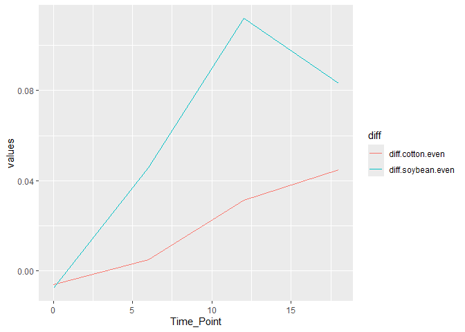

# Global Setup

``` r
library(tidyverse)
```

    ## ── Attaching core tidyverse packages ──────────────────────── tidyverse 2.0.0 ──
    ## ✔ dplyr     1.2.0     ✔ readr     2.1.6
    ## ✔ forcats   1.0.1     ✔ stringr   1.6.0
    ## ✔ ggplot2   4.0.2     ✔ tibble    3.3.1
    ## ✔ lubridate 1.9.5     ✔ tidyr     1.3.2
    ## ✔ purrr     1.2.1     
    ## ── Conflicts ────────────────────────────────────────── tidyverse_conflicts() ──
    ## ✖ dplyr::filter() masks stats::filter()
    ## ✖ dplyr::lag()    masks stats::lag()
    ## ℹ Use the conflicted package (<http://conflicted.r-lib.org/>) to force all conflicts to become errors

``` r
library(knitr)
library(markdown)
# set the default global option for displaying code chunks
knitr::opts_chunk$set(echo = TRUE)
# this sets the root file project to the main R project direcotry not location of current Rmd file
knitr::opts_knit$set(root.dir = rprojroot::find_rstudio_root_file())
```

# 1. Load Data

3 pts. Download two .csv files from Canvas called DiversityData.csv and
Metadata.csv, and read them into R using relative file paths.

``` r
metadata_csv <- read.csv("data_files/Metadata.csv", na.strings = "na")
diversity_data_csv <- read.csv("data_files/DiversityData.csv", na.strings = "na")
```

# 2. Join Data

4 pts. Join the two dataframes together by the common column ‘Code’.
Name the resulting dataframe alpha.

``` r
alpha <- full_join(metadata_csv, diversity_data_csv, by = "Code")
# head() is used to preview set
head(alpha)
```

    ##     Code Crop Time_Point Replicate Water_Imbibed  shannon invsimpson   simpson
    ## 1 S01_13 Soil          0         1            NA 6.624921   210.7279 0.9952545
    ## 2 S02_16 Soil          0         2            NA 6.612413   206.8666 0.9951660
    ## 3 S03_19 Soil          0         3            NA 6.660853   213.0184 0.9953056
    ## 4 S04_22 Soil          0         4            NA 6.660671   204.6908 0.9951146
    ## 5 S05_25 Soil          0         5            NA 6.610965   200.2552 0.9950064
    ## 6 S06_28 Soil          0         6            NA 6.650812   199.3211 0.9949830
    ##   richness
    ## 1     3319
    ## 2     3079
    ## 3     3935
    ## 4     3922
    ## 5     3196
    ## 6     3481

# 3. Perform Calculations

4 pts. Calculate Pielou’s evenness index: Pielou’s evenness is an
ecological parameter calculated by the Shannon diversity index (column
Shannon) divided by the log of the richness column.

1.  Using mutate, create a new column to calculate Pielou’s evenness
    index.
2.  Name the resulting dataframe alpha_even.

``` r
alpha_even <- mutate(alpha, pielou_evenness = shannon / log(richness))
# preview
head(alpha_even)
```

    ##     Code Crop Time_Point Replicate Water_Imbibed  shannon invsimpson   simpson
    ## 1 S01_13 Soil          0         1            NA 6.624921   210.7279 0.9952545
    ## 2 S02_16 Soil          0         2            NA 6.612413   206.8666 0.9951660
    ## 3 S03_19 Soil          0         3            NA 6.660853   213.0184 0.9953056
    ## 4 S04_22 Soil          0         4            NA 6.660671   204.6908 0.9951146
    ## 5 S05_25 Soil          0         5            NA 6.610965   200.2552 0.9950064
    ## 6 S06_28 Soil          0         6            NA 6.650812   199.3211 0.9949830
    ##   richness pielou_evenness
    ## 1     3319       0.8171431
    ## 2     3079       0.8232216
    ## 3     3935       0.8046776
    ## 4     3922       0.8049774
    ## 5     3196       0.8192376
    ## 6     3481       0.8155427

# 4. Statistics

4.  Pts. Using tidyverse language of functions and the pipe, use the
    summarise function and tell me the mean and standard error evenness
    grouped by crop over time.

<!-- -->

1.  Start with the alpha_even dataframe
2.  Group the data: group the data by Crop and Time_Point.
3.  Summarize the data: Calculate the mean, count, standard deviation,
    and standard error for the even variable within each group.
4.  Name the resulting dataframe alpha_average

``` r
alpha_average <- alpha_even %>%
  group_by(Crop, Time_Point) %>%
  summarise(
    count = n(),
    mean_evenness = mean(pielou_evenness, na.rm = TRUE),
    sd_evenness = sd(pielou_evenness, na.rm = TRUE),
    se_evenness = sd_evenness / sqrt(count)
  )
```

    ## `summarise()` has regrouped the output.
    ## ℹ Summaries were computed grouped by Crop and Time_Point.
    ## ℹ Output is grouped by Crop.
    ## ℹ Use `summarise(.groups = "drop_last")` to silence this message.
    ## ℹ Use `summarise(.by = c(Crop, Time_Point))` for per-operation grouping
    ##   (`?dplyr::dplyr_by`) instead.

# 5. Calculate Differences

4.  Pts. Calculate the difference between the soybean column, the soil
    column, and the difference between the cotton column and the soil
    column.

<!-- -->

1.  Start with the alpha_average dataframe
2.  Select relevant columns: select the columns Time_Point, Crop, and
    mean.even.
3.  Reshape the data: Use the pivot_wider function to transform the data
    from long to wide format, creating new columns for each Crop with
    values from mean.even.
4.  Calculate differences: Create new columns named diff.cotton.even and
    diff.soybean.even by calculating the difference between Soil and
    Cotton, and Soil and Soybean, respectively.
5.  Name the resulting dataframe alpha_average2

``` r
alpha_average2 <- alpha_average %>%
  # b) Select relevant columns
  select(Time_Point, Crop, mean_evenness) %>%
  # c) Reshape long -> wide (one column per Crop)
  pivot_wider(
    names_from = Crop,
    values_from = mean_evenness
  ) %>%
  # d) Calculate differences (Soil - Cotton, Soil - Soybean)
  mutate(
    diff.cotton.even  = Soil - Cotton,
    diff.soybean.even = Soil - Soybean
  )
```

# 6. Plots

4 pts. Plot the newly created dataframe using the pipe.

1.  Start with the alpha_average2 dataframe
2.  Select relevant columns: select the columns Time_Point,
    diff.cotton.even, and diff.soybean.even.
3.  Reshape the data: Use the pivot_longer function to transform the
    data from wide to long format, creating a new column named diff that
    contains the values from diff.cotton.even and diff.soybean.even.
4.  Create the plot: Use ggplot and geom_line() with ‘Time_Point’ on the
    x-axis, the column ‘values’ on the y-axis, and different colors for
    each ‘diff’ category. The column named ‘values’ come from the
    pivot_longer. The resulting plot should look like the one to the
    right.

``` r
  # a) start with alpha_average2 dataframe
alpha_average2 %>%
  # b) Select relevant columns
  select(Time_Point, diff.cotton.even, diff.soybean.even) %>%
  # c) Reshape wide -> long
  pivot_longer(
    c(diff.cotton.even, diff.soybean.even),
    names_to = "diff",
    values_to = "values"
  ) %>%
  # d) Plot
  ggplot(aes(x = Time_Point, y = values, color = diff, group = diff)) +
  geom_line()
```

<!-- -->

# 7. Publish

2 pts. Commit and push a gfm .md file to GitHub inside a directory
called Coding Challenge 5. Provide me a link to your github written as a
clickable link in your .pdf or .docx or .html.
